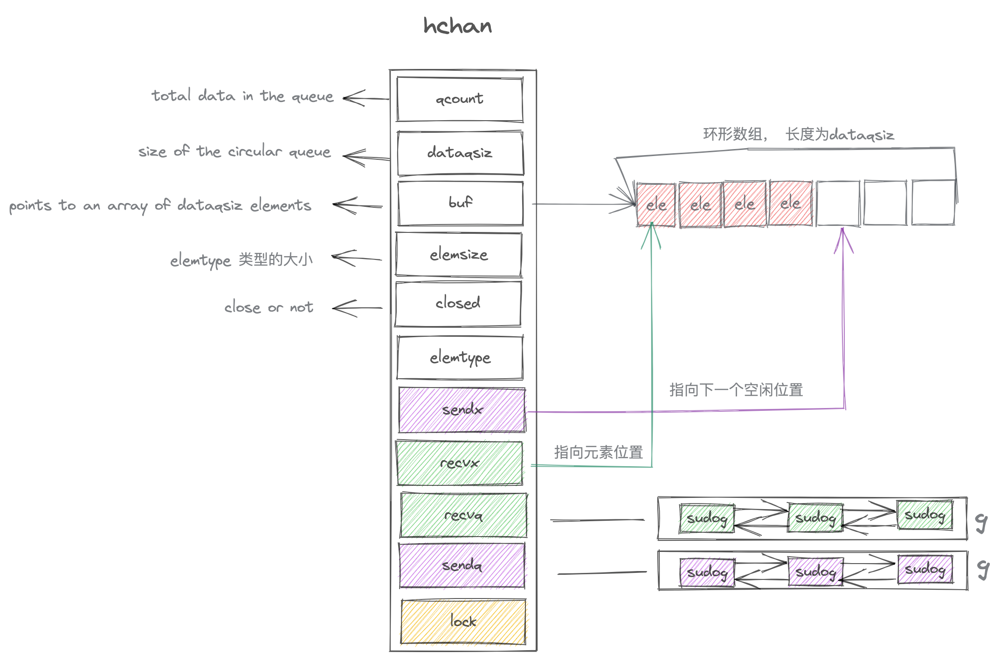

#channel 源码解析

先看看它的数据结构
```go
type hchan struct {
	qcount   uint           // total data in the queue
	dataqsiz uint           // size of the circular queue
	buf      unsafe.Pointer // points to an array of dataqsiz elements
	elemsize uint16
	closed   uint32
	elemtype *_type // element type
	sendx    uint   // send index
	recvx    uint   // receive index
	recvq    waitq  // list of recv waiters
	sendq    waitq  // list of send waiters

	// lock protects all fields in hchan, as well as several
	// fields in sudogs blocked on this channel.
	//
	// Do not change another G's status while holding this lock
	// (in particular, do not ready a G), as this can deadlock
	// with stack shrinking.
	lock mutex
}
```

`qcount` 是当前队列中的数据量
`dataqsiz` 是`circular queue`的容量
`buf` 指向这个`circular queue`的首地址
`recvq` 和 `sendq` 是`g`的双链表， 它们分别代表待接收和待发送的`goroutine`的阻塞链表
```go
type waitq struct {
	first *sudog
	last  *sudog
}
```


