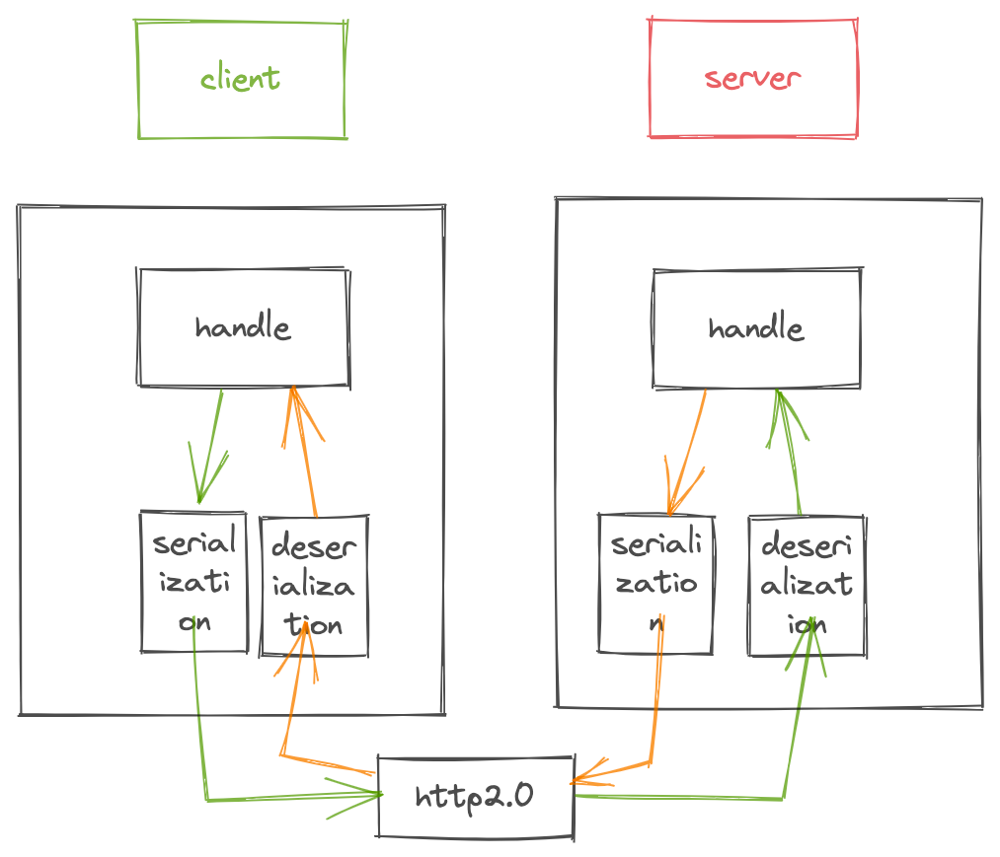
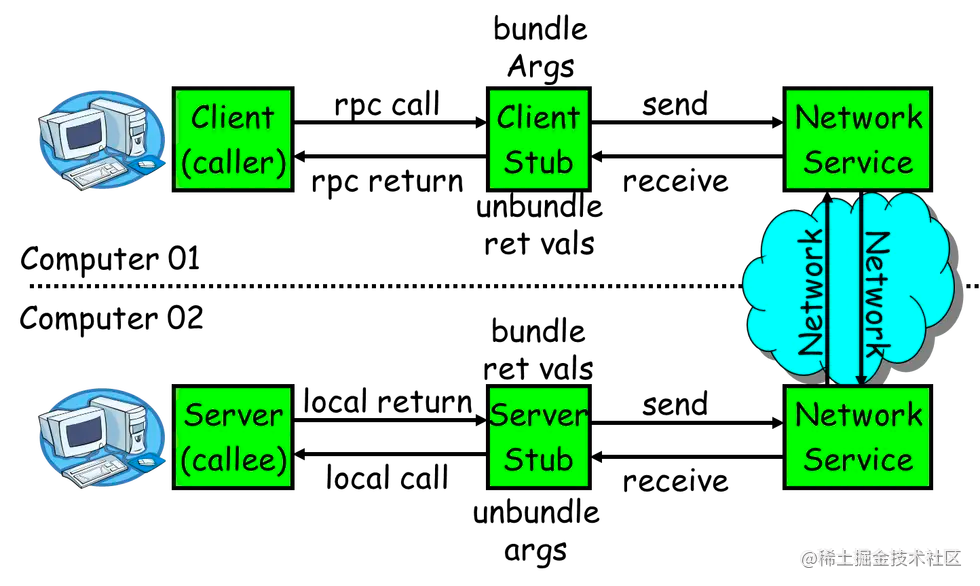

# Go RPC
一个`go rpc`模块

## `RPC` 介绍
RPC是Remote Procedure Call(远程过程调用)的简称,可以让我们像调用本地接口一样使用远程服务。相比`HTTP`调用,`RPC`的方式至少在以下几个方面有优势
1. 传输效率
RPC可以自定义TCP报文,基于TCP协议进行通信,比如`dubbo`;同时也支持使用`HTTP2`协议进行通信,比如`gRPC`。这相比传统的`HTTP1.1`协议报文体积会更小,传输效率会更高。
2. 性能消耗
RPC框架通常自带高效的序列化机制,序列化和反序列化耗时更低,序列化后的字节数通常也更小。
3. 负责均衡
RPC框架通常自带负载均衡策略,而HTTP请求要做负载均衡需要外部应用如Nginx的支持。
4. 服务治理
下游服务新增,重启,下线时能自动通知上游使用者,而HTTP的方式需要事先通知并修改相关配置。

一个官方的配图

## 模块拆分

从上至下依次是（serialization and deserialization）**数据序列化**、**通讯协议**
- 数据序列化
互联网的产生带来了机器间通讯的需求，而互联通讯的双方需要采用约定的协议，序列化和反序列化属于通讯协议的一部分。通讯协议往往采用分层模型，不同模型每层的功能定义以及颗粒度不同，例如：TCP/IP协议是一个四层协议，而OSI模型却是七层协议模型。在OSI七层协议模型中展现层（Presentation Layer）的主要功能是把应用层的对象转换成一段连续的二进制串，或者反过来，把二进制串转换成应用层的对象–这两个功能就是序列化和反序列化。一般而言，TCP/IP协议的应用层对应与OSI七层协议模型的应用层，展示层和会话层，所以序列化协议属于TCP/IP协议应用层的一部分。本文对序列化协议的讲解主要基于OSI七层协议模型。
   - 序列化： 将数据结构或对象转换成二进制串的过程
   - 反序列化：将在序列化过程中所生成的二进制串转换成数据结构或者对象的过程

- 通讯协议： 数据传输的网络协议，一般可以采用http2.0/tcp/自定义协议

## 模块实现
数据序列化，网络上流行的有很多种，如`XM`L、`JSON`、`Protobuf`、`Thrift`和`Avro`

- [ ] 序列化与反序列化
- 

## Reference

1. https://tech.meituan.com/2015/02/26/serialization-vs-deserialization.html
2. https://geektutu.com/post/geerpc-day1.html